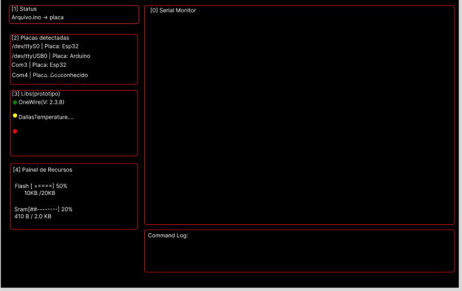

# requisitos minimos

[x]l -> lista placas - arduino-cli board list
[x]u -> upload
[x]c -> compila - arduino-cli compile --fqbn <FQBN> <SKETCH_PATH>
[]i + shift|I -> downloand libs
[]i -> downloand core
[]s -> serial monitor - arduino-cli monitor -p <PORT>

Objetivos futuros:
Ao detectar um #include sem a devida instalação notificar o usuario e deixar a biblioteca
com um ponto vermelho
